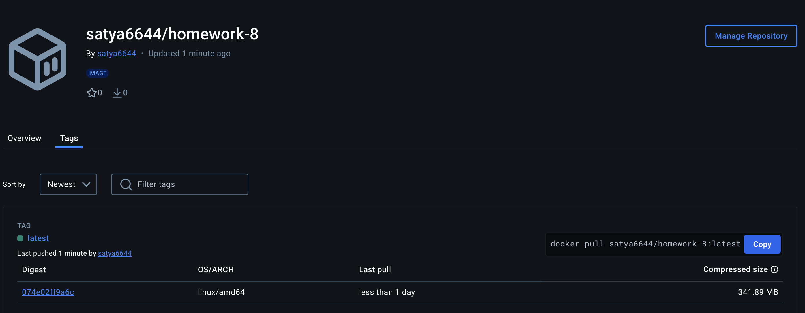
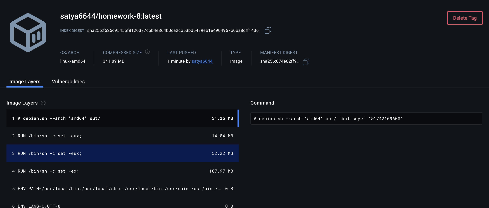

# Homework-8: Devops demo with Docker & GitHub Actions

This project demonstrates how **Docker** and **GitHub Actions** can be used to build, test, and deploy an application. The application is packaged inside a Docker container. The container is then pushed to Docker Hub for easy sharing and deployment.

---

## 🔗 Project Overview

The application is containerized using Docker and the container is deployed using GitHub Actions. This workflow automates the process of building, testing, and pushing the Docker image to **Docker Hub**.

---

## 🌐 Docker Hub Repository

The final Docker image is stored in the **Docker Hub** repository. The following images have been pushed for this project:

### 🖼️ Docker Images





You can view the Docker images in the **Docker Hub** at:  
👉 [https://hub.docker.com/repository/docker/satya6644/homework8](https://hub.docker.com/repository/docker/satya6644/homework8)

---

## 🚀 Getting Started

To get started with this project, follow the steps below to build, test, and run the application locally or through GitHub Actions.

### 1. **Clone the Repository**

```bash
git clone https://github.com/Satyabandi20/homework8.git
cd homework8
```

### 2. **Set Up the Python Environment**

#### Using a Virtual Environment:
```bash
python3 -m venv venv
source venv/bin/activate  # For Windows: venv\Scriptsctivate
pip install -r requirements.txt
```

---

## 🔧 GitHub Actions: CI/CD Pipeline

### Overview

The project leverages **GitHub Actions** for continuous integration and continuous deployment (CI/CD). The pipeline automatically runs tests, builds the Docker image, and pushes it to **Docker Hub** whenever changes are pushed to the `main` branch.

### Key Steps in the GitHub Actions Workflow:
1. **Set up Python**: Ensures that Python dependencies are installed.
2. **Run Tests**: Executes tests using `pytest` to ensure the application works as expected.
3. **Build Docker Image**: Uses `docker/build-push-action` to build the Docker image.
4. **Push Docker Image to Docker Hub**: After a successful build, the image is pushed to Docker Hub.


## 💡 Key Features

- **Containerized Application**: The app runs inside a Docker container, ensuring portability and easy deployment.
- **CI/CD with GitHub Actions**: The project uses GitHub Actions to automate the process of building, testing, and pushing the Docker image.

---

## ✅ Submission Checklist

- [x] Docker image built and pushed to Docker Hub
- [x] GitHub Actions workflow configured and working
- [x] Docker Images screenshots included in the README

---

Thank you for checking out this project! Feel free to explore the code and Docker images. If you have any questions, feel free to reach out
